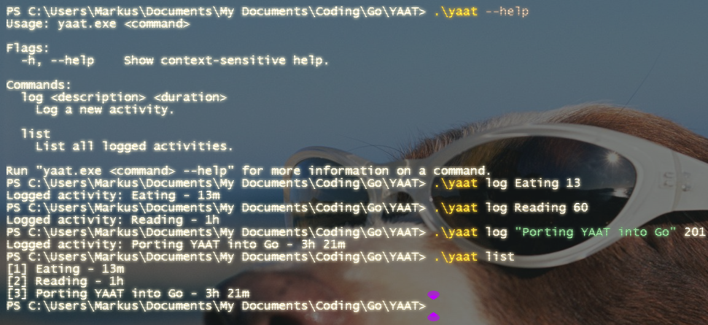

<div align="center">
  
  <br>
  <a href="https://github.com/ctrl-shift-markus/YAAT/releases">
    
  </a>
  
  
  <a href="https://github.com/ctrl-shift-markus/YAAT/blob/main/LICENSE">
    
  </a>
  <p>YAAT (Yet Another Activity Tracker) is an open-source, lightweight and private activity tracker for all platforms built in Go.</p>
</div>

## Installation

To install YAAT, first head over to the [releases page](https://github.com/ctrl-shift-markus/yaat/releases) and download the latest release for your OS and architecture. Next, extract it and move it to your binaries folder:
- For Windows (PowerShell), this would be `Move-Item yaat.exe "$env:LOCALAPPDATA\Microsoft\WindowsApps\" -Force`
- For macOS/Linux, this would be `chmod +x yaat && sudo mv yaat /usr/local/bin/`

If you already have Go installed, you can simply run `go install github.com/ctrl-shift-markus/yaat/cmd/yaat@latest`.

Alternatively, if your architecture isn't supported or you'd rather build YAAT yourself, you can run:
```
git clone https://github.com/ctrl-shift-markus/yaat.git
cd yaat
go build ./cmd/yaat
```
If you want to add flags, feel free to do so after `build`!

## Usage

YAAT has two commands as of v1.0.0: `log` and `list`.

- `log <description> <duration>` logs your activity.
- `list` lists all your activities.

However, I plan to add multiple new commands and options in the near future, including:
- `delete <id>`: Delete activities
- `edit <id> [--description <description>] [--duration <duration>]`: Edit activities
- `log <description> --interactive`: Tracks your activity in the background and automatically saves the total time as the duration when stopped

## Example

The following screenshot shows every command of YAAT and how to use it:



## License

YAAT is licensed under the [GNU General Public License v3.0](LICENSE).